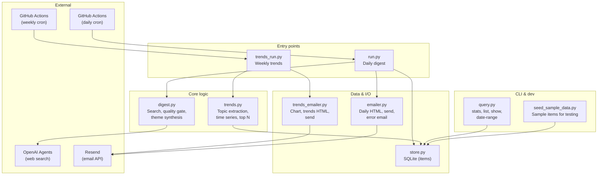
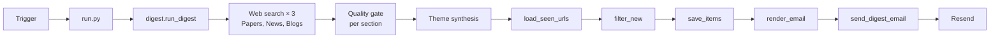
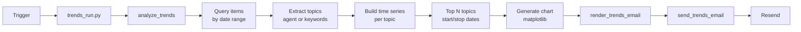

# HDC Digest

Automated email digests for Hyperdimensional Computing (HDC), hypervectors, and Vector Symbolic Architectures (VSA): a **daily digest** of recent items and a **weekly trends** summary with charts.

## Features

- **Daily digest** — Scheduled via GitHub Actions. Three searches (Papers, News, Blogs), quality gate, deduplication, HTML email via Resend.
- **Weekly trends** — Analyzes the SQLite archive for top topics, builds a trend chart (weeks/months/years), and sends a summary email on Sundays.
- **Local tools** — Justfile recipes for run, preview, seed sample data, and database queries.

## Component diagram



## Workflow diagrams

### Daily digest workflow

Runs every day at 15:00 UTC (~7am Pacific). Fetches new items, deduplicates, saves to DB, and sends one email.



### Weekly trends workflow

Runs every Sunday at 16:00 UTC (8am PST). Reads from DB, computes trends and chart, sends one email.



## Run locally

```bash
# Install (use uv recommended)
uv sync
# or: pip install -e .

# Environment
export OPENAI_API_KEY=...
export RESEND_API_KEY=...
export EMAIL_TO=you@example.com
export EMAIL_FROM="HDC Digest <digest@yourdomain.com>"
# Or use a .env file; just recipes load it automatically.
```

**Daily digest**

```bash
just run                  # Run and send email
just dry-run              # Run, save to DB, no email
just preview              # Run and open HTML preview in browser
```

**Weekly trends**

```bash
just trends               # Analyze and send email
just trends-dry-run       # Analyze, no email
just trends-preview       # Analyze and open preview in browser
```

**Database**

```bash
just seed                 # Seed sample data for testing
just stats                # Database statistics
just list                 # Recent items
just date-range 2025-01-01 2025-02-01
```

See `just help` or `just --list` for all commands.

## Schedules (GitHub Actions)

| Workflow        | Schedule (UTC) | Local (Pacific)   |
|----------------|----------------|------------------|
| Daily digest   | 15:00 daily    | ~7am             |
| Weekly trends  | 16:00 Sundays  | 8am PST (Sunday) |

Both workflows support **Run workflow** from the Actions tab for manual runs.

## License

See repository.
